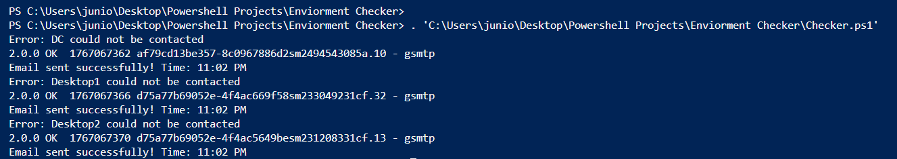
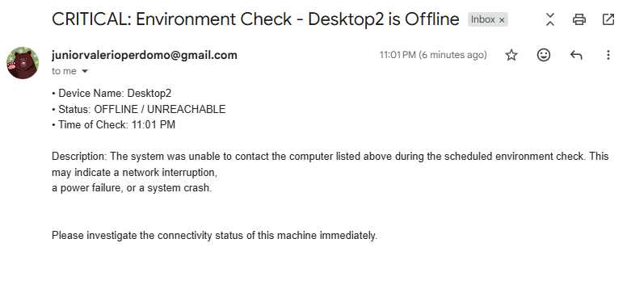
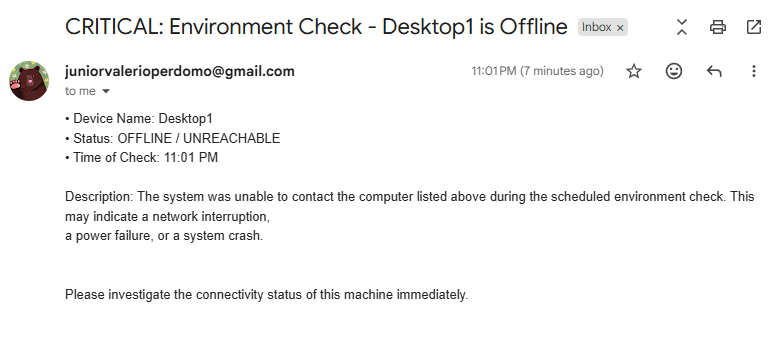
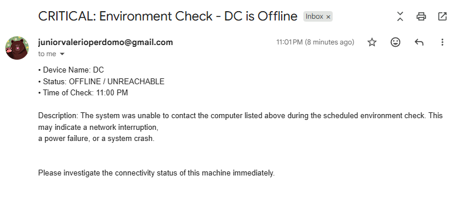

# powershell-environment-monitoring
This project is a PowerShell-based environment monitoring tool designed to track the availability of domain-joined systems in a Windows Active Directory lab. It performs automated connectivity checks and sends real-time email alerts when critical systems become unreachable.
The solution simulates a small enterprise environment to demonstrate proactive monitoring, automation, and basic incident alerting.

---

## Environment
- **Domain:** gethired.com
- **Virtualization:** VirtualBox
- **Systems Monitored:**
  - DC (Domain Controller)
  - desktop1
  - desktop2

The Domain Controller is treated as a critical system expected to remain online continuously to provide authentication, DNS, and directory services.

---

## Features
- Automated connectivity checks using `Test-Connection`
- CSV-driven host inventory for easy scalability
- Real-time email alerts when systems go offline
- Secure credential handling using encrypted XML (`Export-Clixml`)
- SMTP integration using MailKit and MimeKit
- Clear alert messaging with timestamps and system details

---

## How It Works
1. Reads a list of computer names from a CSV file

3. Pings each system using `Test-Connection`

4. Detects offline or unreachable devices

5. Sends an email alert identifying:
   - Affected device
   - Status
   - Time of detection
   

     

       

6. Cleans up SMTP connections safely after execution

---

## Technologies Used
- PowerShell 5+
- Windows Server (Active Directory)
- VirtualBox
- MailKit / MimeKit
- SMTP (Gmail)
- CSV-based configuration
- Secure credential storage (Clixml) - Will not upload this file

---

## Use Case
This project demonstrates how IT support and systems administrators can:
- Monitor critical infrastructure
- Detect outages early
- Reduce downtime
- Maintain service availability
- Support business continuity

---

## Security Notes
- Credentials are stored securely using encrypted Clixml
- No plaintext passwords are included
- Example credential file is provided for reference only

---

## Future Improvements
- Scheduled execution via Task Scheduler
- Logging to file or Event Viewer
- SMS or Teams alerts
- Retry thresholds before alerting
- HTML-formatted email alerts

---

## Author
Giovanny Junior Valerio Perdomo
